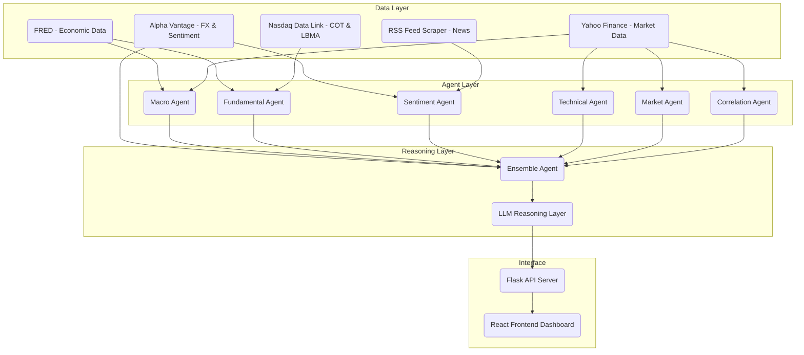

# Gold & Silver Agent: Architecture Documentation

## 1. Purpose Statement
The **Gold & Silver Agent** is an advanced analytical system designed to provide multi-dimensional market predictions and insights for precious metals (Gold and Silver). By synthesizing macroeconomic data, institutional positioning, technical indicators, and real-time sentiment analysis, the system acts as a "Quantitative Analyst in a Box" to help users understand complex market drivers.

---

## 2. Architecture Flow
The system follows a modular, hierarchical architecture where specialized agents aggregate data into a final ensemble prediction.



---

## 3. File Structure
The codebase is organized into functional modules for clarity and extensibility:

```text
/GoldSilverAgent
├── /agents               # Prediction logic for various market aspects
│   ├── base_agent.py     # Base class for all specialized agents
│   ├── ensemble_agent.py # Aggregates signals from all agents
│   ├── macro_agent.py    # Analyzes Rates, Inflation, Reserves
│   ├── fundamental_agent.py # Analyzes Institutional Positioning (COT)
│   └── sentiment_agent.py # Analyzes News and Social context
├── /data_sources         # API Clients and Data Aggregators
│   ├── fred_client.py    # Federal Reserve Economic Data
│   ├── nasdaq_client.py  # Nasdaq Data Link (Quandl) client
│   ├── alpha_vantage_client.py # Alpha Vantage API client
│   └── sentiment_client.py # RSS Scraper & NLTK Sentiment Scorer
├── /reasoning            # LLM-based explanation and logic
│   └── llm_reasoning.py  # Generates narrative explanations for predictions
├── /scripts              # Utility and verification scripts
├── api_server.py         # Flask backend serving data to UI
├── config.py             # Global settings, API keys, and data sources
└── main.py               # CLI entry point for the system
```

---

## 4. How the Code Works (Step-by-Step)

### A. Data Collection
Every analytical cycle begins in the `data_sources/` layer. Each client is responsible for:
1.  **Fetching**: Communicating with external REST APIs (FRED, Nasdaq, Alpha Vantage).
2.  **Formatting**: Converting raw JSON/CSV into sanitized `pandas` DataFrames.
3.  **Caching**: Using a local TTL-based cache to prevent redundant API calls and rate-limiting.

### B. Agent-Based Analysis
Specialized agents (e.g., `FundamentalAgent`) call these clients to retrieve specific metrics.
*   **Signal Normalization**: Agents convert numeric metrics (like Inflation spikes or RSI) into a categorized signal: `bullish`, `neutral`, or `bearish`.
*   **Driver Identification**: Agents identify the "Reason Why" for their signal (e.g., "Yield curve inversion detected").

### C. Ensemble Orchestration
The `EnsembleAgent` acts as the project manager. It:
1.  Triggers all active agents in parallel.
2.  Applies a **Weighted Average** to the signals based on pre-defined weights in `config.py`.
3.  Calculates **Ensemble Confidence** based on the level of agreement between agents.

### D. Reasoning & Explanation
The `LLMReasoningLayer` takes the structured output from the Ensemble Agent and sends it to OpenAI (GPT-4o). It transforms the raw numbers into a professional commodities report, explaining risks, invalidation conditions, and the macroeconomic narrative.

### E. Delivery
The `api_server.py` exposes these results via REST endpoints. The React frontend periodically polls these endpoints to update graphs, dials, and the chat interface, providing the user with a real-time command center.
